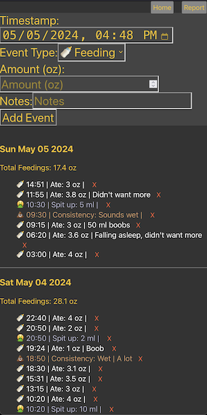
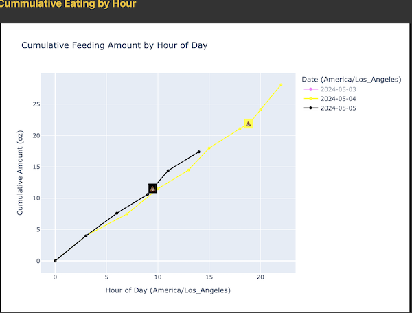

### Baby Feeding Log


* Add feedings, poops, and spit-ups.


* Cumulative plot by hour of day for the last 7 days.
  * Useful for making sure the rate at which baby is eating makes sense.


### Installation
##### Pre-requisites
1. `docker-compose`

##### Steps
```bash
git clone https://github.com/maksimt/baby-feeding-log.git
cd baby-feeding-log

# So that you can access the UI from hosts other than the
# host on which this is running, we capture the hostname
# on which this is running and save it for the UI.
export REACT_APP_BACKEND_URL=http://$(hostname -I | awk '{print $1}'):7989
docker-compose up --build -d
```
2. Navigate to `http://$(hostname):7988`.